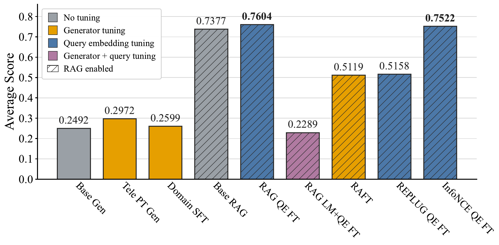
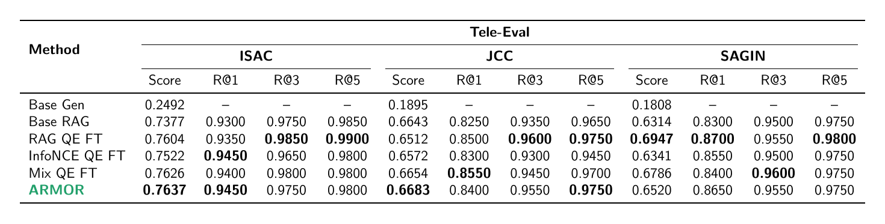
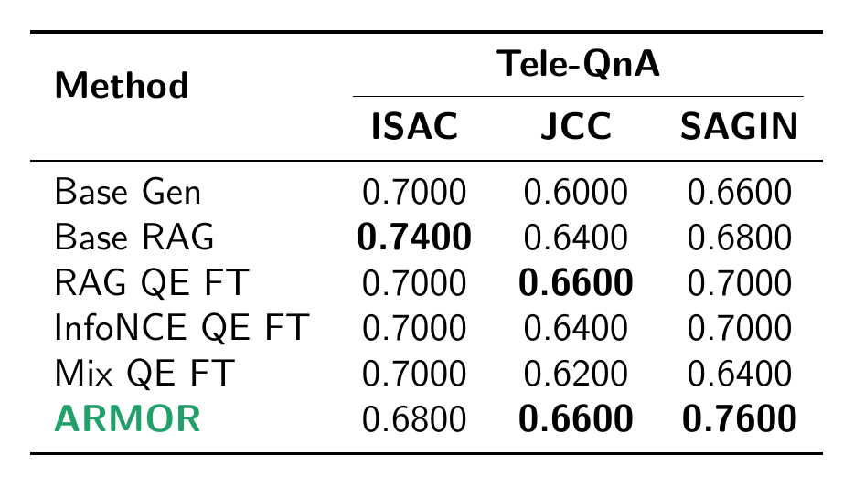
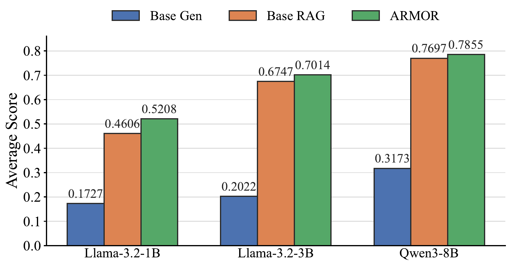
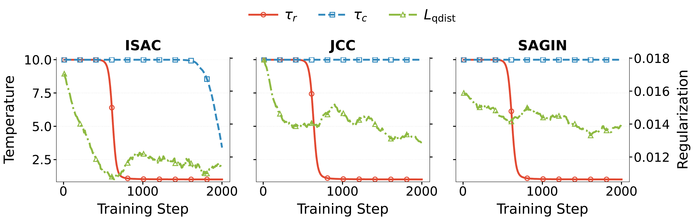

<table>
  <tr>
    <td width="250" align="center">
      
    </td>
    <td>
      <h1>ARMOR: Adaptive Regularized Mixture Optimization for Retrievers</h1>
      <p><strong>Low-resource domain adaptation for retrieval-augmented generation.</strong></p>
    </td>
  </tr>
</table>

---

## Overview

ARMOR is a retriever-centric adaptation method for low-resource domain RAG. In many specialized domains, only a small amount of supervision is available, while the document corpus is fixed and expensive to re-index. ARMOR targets this setting by keeping the generator and document index fixed and adapting the query encoder, concentrating limited supervision on the component that controls which evidence is shown to the model.

The method combines two complementary retriever objectives:

- **RAG likelihood**, which rewards retrieved documents that improve answer generation.
- **InfoNCE contrastive learning**, which improves the semantic retrieval geometry.

ARMOR balances these objectives through learnable temperatures and regularizes the adapted query encoder toward the frozen base query encoder, helping preserve compatibility with the existing document embedding space.

<p align="center">
  
</p>

<p align="center">
  <em>Retriever-side query-encoder adaptation provides a strong low-resource adaptation path compared with generator-side tuning and other baselines.</em>
</p>

## Method

In the ARMOR setup, documents are embedded once using a base dense retriever and stored in a fixed index. During adaptation, only the query encoder is updated.

At a high level, ARMOR optimizes:

```text
ARMOR loss = RAG likelihood + InfoNCE + query distillation
```

where the RAG and InfoNCE terms use separate learned temperatures. These temperatures control how sharply each objective shapes the query encoder during training, while query distillation discourages the adapted query encoder from drifting too far away from the base retrieval space.

## Results

ARMOR is evaluated on two complementary benchmarks. **Tele-Eval** measures open-ended QA quality and retrieval fidelity on domain-aligned evaluation splits, while **Tele-QnA** measures multiple-choice accuracy in a broader out-of-corpus transfer setting. The baselines compare closed-book generation, frozen RAG, single-objective query-encoder fine-tuning, static mixed-objective fine-tuning, and ARMOR.

<p align="center">
  
</p>

<p align="center">
  <em>Tele-Eval compares open-ended QA score and retrieval recall across ISAC, JCC, and SAGIN. ARMOR gives the best average answer score on ISAC and JCC, while RAG QE FT is strongest on SAGIN.</em>
</p>

Tele-Eval evaluates whether the adapted retriever improves generation when the benchmark is aligned with the domain corpus used for training. The results show that query-encoder adaptation is consistently competitive with frozen Base RAG, and ARMOR provides the strongest overall tradeoff across answer quality and retrieval recall in the ISAC and JCC splits.

<p align="center">
  
</p>

<p align="center">
  <em>Tele-QnA compares multiple-choice accuracy across the same domain categories, using a harder transfer benchmark that is not drawn from the adaptation corpus.</em>
</p>

Tele-QnA measures whether the adapted retriever transfers beyond the training-aligned corpus. The results are more mixed: frozen Base RAG remains strongest on ISAC, ARMOR ties the best JCC accuracy, and ARMOR obtains the best SAGIN accuracy. This split is useful because it separates in-corpus specialization from broader domain transfer.

### Generator Scale

The generator-scale comparison evaluates Base Gen, Base RAG, and ARMOR across different generator backbones. This experiment asks how much retriever optimization helps when the generator itself becomes stronger.

<p align="center">
  
</p>

<p align="center">
  <em>ARMOR improves over Base RAG across generator backbones, with the largest gains for smaller generators that rely more heavily on retrieved evidence.</em>
</p>

### Training Dynamics

The training-dynamics figure tracks the learned retrieval temperature, learned contrastive temperature, and query-distillation regularization during ARMOR optimization. It illustrates how the adaptive objective changes over training rather than using a fixed objective balance throughout.

<p align="center">
  
</p>

The retrieval temperature sharpens during training, indicating that the retriever increasingly focuses on high-utility evidence. Query distillation helps constrain this adaptation so the tuned query encoder remains compatible with the frozen document embedding space.

## Repository Structure

- `unified_data_gen/`: data preparation pipeline for building domain-specific training data. It covers document filtering, corpus indexing, QA generation, QA-to-evidence alignment, and train/validation/test split creation.
- `retriever_training/`: training scripts for retriever adaptation, mixed-objective optimization, generator-side baselines, and related comparison methods.
- `evaluation/`: evaluation scripts for Tele-Eval and Tele-QnA, plus launchers for running trained methods on the supported evaluation splits.

## Setup

Create a conda environment with Python 3.10 and install the repository dependencies:

```bash
cd /data/hdf/ARMOR
conda create -n armor python=3.10 -y
conda activate armor
pip install -r requirements.txt
```

## Running Experiments

First, generate the ISAC dataset and retrieval index:

```bash
cd /data/hdf/ARMOR/unified_data_gen
export OPENAI_API_KEY=<your_openai_api_key>

bash run_pipeline.sh isac
```

The pipeline filters `AliMaatouk/Tele-Data` for ISAC, builds a FAISS/SQLite retrieval index, generates grounded QA pairs, aligns QA examples to indexed chunks, and writes train/validation/test splits under `unified_data_gen/data/isac/`. Because the ARMOR release currently includes only `domains/isac`, `run_pipeline.sh` accepts only `isac`.

The generated files used by the training script include:

```text
unified_data_gen/data/unified/unified_index.faiss
unified_data_gen/data/unified/unified_chunks.sqlite
unified_data_gen/data/isac/aligned_train_unified.jsonl
unified_data_gen/data/isac/aligned_val_unified.jsonl
unified_data_gen/data/isac/splits/ft/train.jsonl
unified_data_gen/data/isac/splits/ft/val.jsonl
unified_data_gen/data/isac/splits/raft/train.jsonl
unified_data_gen/data/isac/splits/raft/val.jsonl
```

Use `retriever_training/train_isac_all_methods.sh` to launch the main training methods:

```bash
cd retriever_training

# Examples:
bash train_isac_all_methods.sh rag
bash train_isac_all_methods.sh contriever
bash train_isac_all_methods.sh mix_static
bash train_isac_all_methods.sh mix_adaptive
```

The available training methods are:

```text
rag, contriever, mix_static, mix_adaptive, rag_lm_query_ft, raft, replug, sft
```

The evaluation script runs the retriever-trained methods with their saved `query_encoder_final` checkpoints, evaluates `rag_lm_query_ft` with both `lm_final` and `query_encoder_final`, evaluates `sft` as a closed-book generator, and uses the RAFT-style evaluator from `/data/hdf/telecom-co-scientist/eval/isac/eval_rag_raft.py` for `raft`.

By default, the script assumes checkpoints and data follow the paths produced by `train_isac_all_methods.sh`. Override paths or hyperparameters from the shell when needed:

```bash
CKPT_ROOT=/path/to/checkpoints \
UNIFIED_INDEX=/path/to/unified_index.faiss \
UNIFIED_DB=/path/to/unified_chunks.sqlite \
DOMAIN_TEST=/path/to/test.jsonl \
TELE_EVAL_IN=/path/to/in_domain.jsonl \
TELE_EVAL_OUT=/path/to/out_domain.jsonl \
LR=2e-5 BS=4 TOP_K=16 \
bash evaluation/eval_isac_all_methods_sample.sh
```

## Citation

TODO: Add citation information when the paper entry is ready.

## License

TODO: Add license information.
