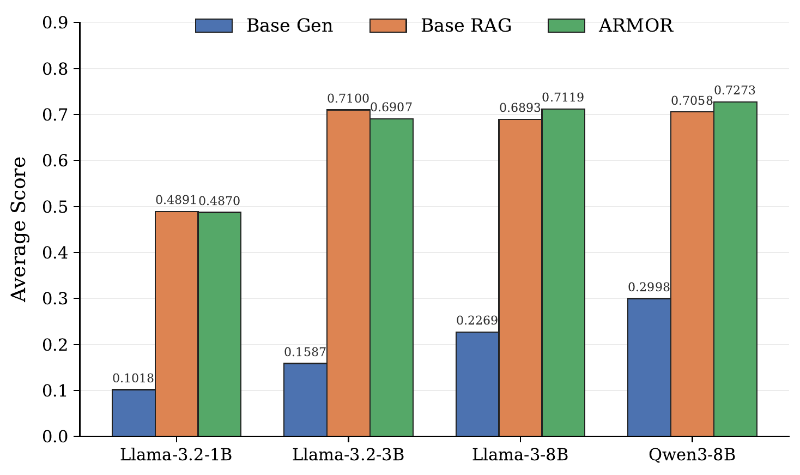

<table>
  <tr>
    <td width="250" align="center">
      
    </td>
    <td>
      <h1>ARMOR: Adaptive Regularized Mixture Optimization for Retrievers</h1>
      <p><strong>Low-resource domain adaptation for retrieval-augmented generation.</strong></p>
    </td>
  </tr>
</table>

---

## Overview

ARMOR is a retriever-centric adaptation method for low-resource domain RAG. In many specialized domains, only a small amount of supervision is available, while the document corpus is fixed and expensive to re-index. ARMOR targets this setting by keeping the generator and document index fixed and adapting the query encoder, concentrating limited supervision on the component that controls which evidence is shown to the model.

The method combines two complementary retriever objectives:

- **RAG likelihood**, which rewards retrieved documents that improve answer generation.
- **InfoNCE contrastive learning**, which improves the semantic retrieval geometry.

ARMOR balances these objectives through learnable temperatures and regularizes the adapted query encoder toward the frozen base query encoder, helping preserve compatibility with the existing document embedding space.

<p align="center">
  
</p>

<p align="center">
  <em>Retriever-side query-encoder adaptation provides a strong low-resource adaptation path compared with generator-side tuning and other baselines.</em>
</p>

**Figure 1 Description & Motivation:**
This diagram contrasts the main paradigms of low-resource domain adaptation for retrieval-augmented generation. Standard RAG uses a completely frozen retriever and document index, which is suboptimal for highly specialized domains. Generator fine-tuning is computationally intensive and can degrade general-purpose capabilities. Regenerating document embeddings to rebuild the index is also extremely expensive. ARMOR adapts the query encoder while keeping the generator and document index fixed, concentrating domain supervision where it is most compute- and sample-efficient.

## Method

In the ARMOR setup, documents are embedded once using a base dense retriever and stored in a fixed index. During adaptation, only the query encoder is updated.

At a high level, ARMOR optimizes:

```text
ARMOR loss = RAG likelihood + InfoNCE + query distillation
```

where the RAG and InfoNCE terms use separate learned temperatures. These temperatures control how sharply each objective shapes the query encoder during training, while query distillation discourages the adapted query encoder from drifting too far away from the base retrieval space.

## Repository Structure

- `data_gen/`: data preparation pipeline for building the ISAC training data. It covers document filtering, corpus indexing, QA generation, QA-to-evidence alignment, and train/validation/test split creation.
- `retriever_training/`: training scripts for retriever adaptation using the **ARMOR** method.
- `evaluation/`: evaluation scripts for the Tele-Eval benchmark.

## Setup

Create a conda environment with Python 3.10 and install the repository dependencies:

```bash
cd /data/hdf/ARMOR_clean
conda create -n armor python=3.10 -y
conda activate armor
pip install -r requirements.txt
```

## Running Experiments

### 1. Data Generation
First, generate the ISAC dataset and retrieval index:

```bash
cd /data/hdf/ARMOR_clean/data_gen
export OPENAI_API_KEY=<your_openai_api_key>

bash run_pipeline.sh isac
```

The pipeline filters `AliMaatouk/Tele-Data` for ISAC, builds a FAISS/SQLite retrieval index, generates grounded QA pairs, aligns QA examples to indexed chunks, and writes train/validation/test splits under `data_gen/data/isac/`.

The generated files used by the training script include:

```text
data_gen/data/unified/unified_index.faiss
data_gen/data/unified/unified_chunks.sqlite
data_gen/data/isac/aligned_train_unified.jsonl
data_gen/data/isac/aligned_val_unified.jsonl
data_gen/data/isac/splits/raft/train.jsonl
data_gen/data/isac/splits/raft/val.jsonl
```

### 2. Retriever Training
Use `retriever_training/train_isac_armor.sh` to launch the ARMOR query encoder training on the generated ISAC dataset:

```bash
cd ../retriever_training
bash train_isac_armor.sh
```

By default, training will run on GPUs `0` and `1`. This will optimize the query encoder weights and learned temperatures, saving checkpoints and logs under the `checkpoints/` directory.

### 3. Evaluation
After training completes, run evaluations for both the baseline configurations (Closed-Book, Base RAG) and your trained ARMOR checkpoint against the **Tele-Eval** benchmark:

```bash
cd ../evaluation
bash eval_isac_armor.sh
```

By default, evaluation results will be saved under the `results_isac/` directory.

## Evaluation Results

We evaluate our adapted retrievers and baselines on the **Tele-Eval** benchmark using a generator model. The dense retriever is evaluated under `topk=16` retrieval context setup. All results below are reported on the standard 150-sample evaluation slice, using scripts from the [evaluation/](file:///data/hdf/ARMOR_clean/evaluation) folder.

### 1. Tele-Eval Main Results

The table below summarizes the open-ended QA score (as graded by the LLM judge on a 0.0 to 1.0 scale) and passage chunk recall (R@1, R@3, R@5) across three distinct telecom-specific domains: ISAC (Integrated Sensing and Communication), JCC (Joint Communication and Control), and SAGIN (Space-Air-Ground Integrated Network).

| Method | ISAC Score | ISAC R@1 | ISAC R@3 | ISAC R@5 | JCC Score | JCC R@1 | JCC R@3 | JCC R@5 | SAGIN Score | SAGIN R@1 | SAGIN R@3 | SAGIN R@5 |
| :--- | :---: | :---: | :---: | :---: | :---: | :---: | :---: | :---: | :---: | :---: | :---: | :---: |
| Base Gen | 0.2269 | -- | -- | -- | 0.2980 | -- | -- | -- | 0.3017 | -- | -- | -- |
| Base RAG | 0.6893 | **0.5467** | 0.7400 | 0.8067 | **0.7763** | 0.4800 | 0.6133 | 0.7000 | 0.7660 | **0.6400** | 0.8133 | 0.8400 |
| RAG QE FT | 0.6584 | 0.5000 | 0.6533 | 0.7400 | 0.7230 | 0.3867 | 0.6000 | 0.6533 | 0.7573 | 0.5000 | 0.6933 | 0.7867 |
| InfoNCE QE FT | 0.6685 | 0.5200 | 0.6733 | 0.7533 | 0.7425 | 0.4133 | 0.6200 | 0.6800 | 0.7662 | 0.5333 | 0.7400 | 0.8067 |
| Mix QE FT | 0.6854 | 0.4733 | 0.6333 | 0.7133 | 0.7360 | 0.4467 | 0.6400 | 0.6800 | 0.7591 | 0.5000 | 0.7200 | 0.7800 |
| ARMOR | **0.7119** | 0.5267 | **0.7667** | **0.8200** | 0.7719 | **0.4933** | **0.6467** | **0.7133** | **0.7685** | 0.6267 | **0.8400** | **0.8467** |

*Note: The best values within each domain and metric are bolded.*

**Accompanying Analysis & Key Takeaways:**
- **Adaptation Performance:** ARMOR demonstrates robust domain adaptation, securing the highest open-ended QA score on the ISAC (0.7119) and SAGIN (0.7685) domains, and performing competitively on JCC.
- **Retrieval Quality Improvements:** Standard fine-tuning (RAG QE FT and InfoNCE QE FT) and naive static mixing (Mix QE FT) degrade retrieval quality due to uncontrolled representation drift. ARMOR's combination of adaptive temperature-scaled objectives and query distillation regularization stabilizes training, resulting in consistently superior chunk recall (R@3 and R@5) across all evaluation domains.

---

### 2. ARMOR Component Ablation

The table below presents the component ablation for ARMOR on the ISAC domain, evaluating different combinations of learnable temperatures and distillation regularization:

| Method | Adaptive Temps | Regularization | Average Score |
| :--- | :---: | :---: | :---: |
| Base RAG | -- | -- | 0.689 |
| RAG QE FT | -- | -- | 0.658 |
| InfoNCE QE FT | -- | -- | 0.669 |
| Mix QE FT | no | no | 0.685 |
| Static Mix with Reg. | no | yes | 0.673 |
| Dynamic Mix without Reg. | yes | no | 0.635 |
| ARMOR | yes | yes | **0.712** |

*Caption: Component ablation for ARMOR on ISAC Tele-Eval. Higher is better. Each row ablates a different combination of ARMOR components: adaptive temperatures ($\tau_r$, $\tau_c$) and query-distillation regularization ($\mu$). Base RAG is included as a reference for the unadapted retriever.*


**Accompanying Analysis & Key Takeaways:**
- **Destructive Drift Without Regularization:** Tuning solely with InfoNCE or RAG loss, or employing a static mixture without regularization, results in query representation drift that underperforms the un-tuned base model.
- **Regularization Benefit:** The inclusion of query distillation regularization preserves semantic compatibility, lifting the average score and preventing query encoder drift.
- **Learnable Loss Balancing:** The full ARMOR framework combines learnable temperatures (which dynamically scale the mixture weights) with query distillation, achieving the best score of 0.712.

---

### 3. Model Scale Ablation

The figure below evaluates the average generation scores across different generator model scales (1B, 3B, 8B parameters) in closed book (Base Gen), un-tuned RAG (Base RAG), and ARMOR configurations:

<p align="center">
  
</p>

<p align="center">
  <em>Figure 2: Average generation scores across different generator models in closed book (Base Gen), un-tuned RAG (Base RAG), and ARMOR configurations on ISAC.</em>
</p>

**Accompanying Analysis & Key Takeaways:**
- **Capacity Bottlenecks:** While increasing generator size scale-up general closed-book and base-RAG capabilities, smaller generators (1B and 3B parameters) exhibit reasoning limitations that prevent them from fully exploiting retriever-side improvements.
- **Synergistic Improvement at Scale:** ARMOR achieves clear improvements over Base RAG for the 8B models (Llama-3-8B and Qwen3-8B), demonstrating that a highly capable generator is required to translate better retrieval relevance into superior final answers.

## Acknowledgement

We would like to thank all projects this repo is built on, especially [Tele-LLMs](https://github.com/Ali-maatouk/Tele-LLMs) for open-sourcing [Tele-Data](https://huggingface.co/datasets/AliMaatouk/Tele-Data) and [Tele-Eval](https://huggingface.co/datasets/AliMaatouk/Tele-Eval) datasets, which are used in this project.

